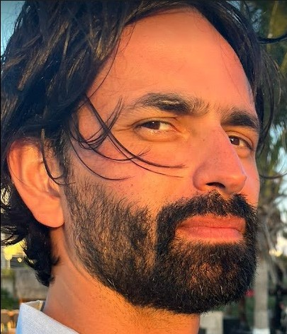

I'm an Assistant Professor at the [Department of Data Analytics and Digitalisation](https://www.maastrichtuniversity.nl/research/department-data-analytics-and-digitalisation-dad) (School of Business and Economics) of [Maastricht University](https://www.maastrichtuniversity.nl/). My main research interests are in machine learning for complex networks, in particular the use of probabilistic generative models and Bayesian inference.

I completed my doctorate at the Computer Science Department of University College London while working as a research scientist at BAE Systems Advanced Technology Centre and then later as a research associate at UCL CEGE Department working on the Crime Policing and Citizenship Project. I have held postdoctoral positions at University of Colorado at Boulder and Université catholique de Louvain and have been a visiting researcher at the Université de Namur.

## My Research

I have broad research interests and enjoy working on a variety of interdisciplinary data-driven projects. My main focus is on using hierarchical Bayesian models to investigate different aspects of the structure of complex networks. These networks, in which the nodes and edges represent entities and their pairwise interactions, provide a common representation for a multitude of complex systems.  

### Network structure and metadata

Systems we represent using networks typically consist of more than just nodes and edges, but instead contain rich objects and interactions that have properties or features of their own. In network terms, these properties are described as metadata attached to the nodes or edges. My research involves examining the relationship between node metadata and network structure to develop new tools for predicting missing values and explaining link formation.

- **Peel**, Delvenne, Lambiotte, [Multiscale mixing patterns in networks](https://doi.org/10.1073/pnas.1713019115) _PNAS_ 2018
- **Peel**, [Graph-based semi-supervised learning for relational networks](https://doi.org/10.1137/1.9781611974973.49) _SIAM International Conference on Data Mining (SDM)_ 2017
- **Peel**, Larremore, Clauset, [The ground truth about metadata and community detection in networks](http://advances.sciencemag.org/content/3/5/e1602548) _Science Advances_ 2017
- **Peel**, [Topological Feature Based Classification](http://ieeexplore.ieee.org/xpl/articleDetails.jsp?arnumber=5977581) _14th International Conference on Information Fusion (FUSION)_ 2011

### Large-scale structure in temporal networks

Many of the complex systems that we use networks to represent are dynamic in nature. That is, interactions form and dissipate over time causing the structure of the network to evolve and change. I develop methods to reliably determine if, when and how the mesoscopic structure of a network changes.

- Ghasemian, Zhang, Clauset, Moore, **Peel**, [Detectability thresholds and optimal algorithms for community structure in dynamic networks](http://link.aps.org/doi/10.1103/PhysRevX.6.031005) _Physical Review X_ 2016
- **Peel**, Clauset, [Detecting Change Points in the Large-scale Structure of Evolving Networks](http://www.aaai.org/ocs/index.php/AAAI/AAAI15/paper/view/9485) _29th AAAI Conference on Artificial Intelligence (AAAI)_ 2015